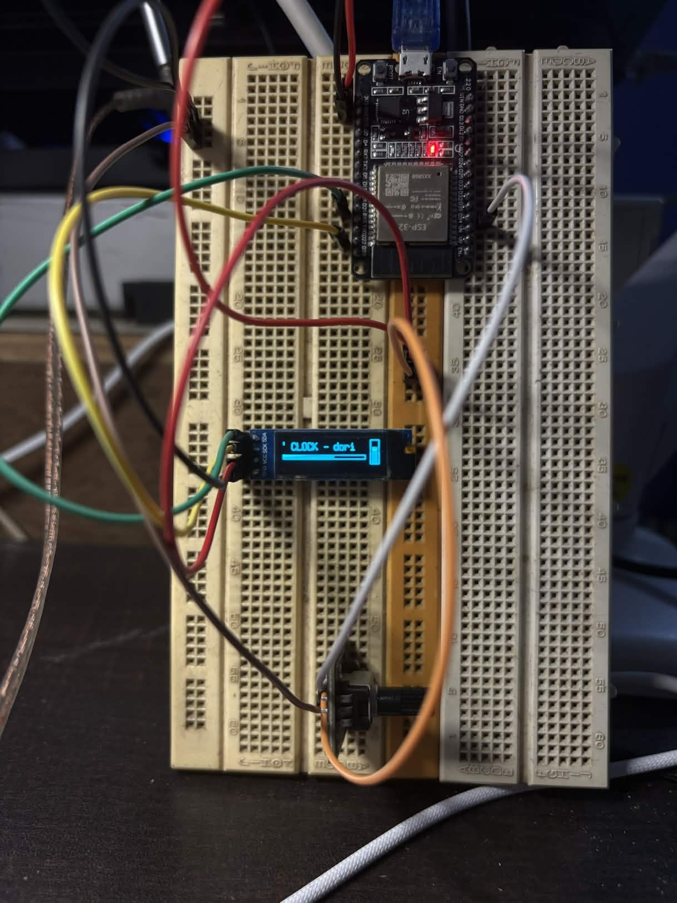

# 🎵 NowByte

NowByte is a compact ESP32-powered Spotify project that lets you display playback information/status and control player volume.

## 🛠 Components Used

* **ESP32 30 Pin CP2102**
* **0.91 inch 128x32 OLED Display (I2C)**
* **Rotary Potentiometer Analog Knob Encoder**

---

## 📸 Project Image

